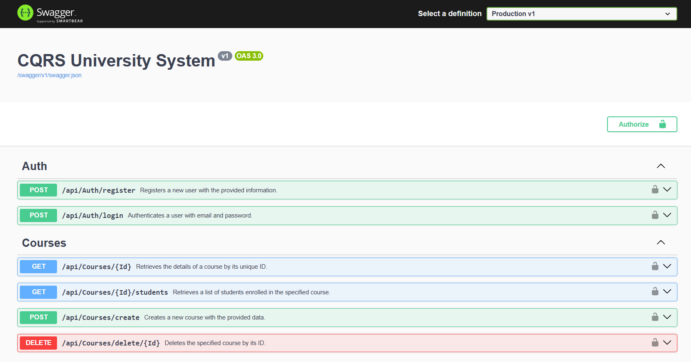
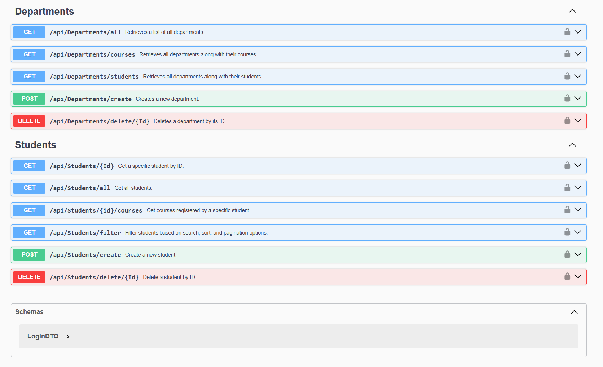

# 🎓 CQRS University System


A personal .NET 8 Web API project that manages university operations (students, courses, departments, and authentication) using **CQRS**, **MediatR**, **EF Core**, and **ASP.NET Identity**. Built with Clean Architecture (4-Tier) for scalability, maintainability, and separation of concerns.

---

## 📚 Technologies Used

- ✅ .NET 8
- ✅ CQRS Pattern
- ✅ MediatR
- ✅ Entity Framework Core
- ✅ ASP.NET Identity
- ✅ JWT Token Authentication
- ✅ FluentValidation
- ✅ Swagger UI
- ✅ Visual Studio 2022

---

## 🧱 Project Architecture

```

📁 CQRSUniversitySystem.Application
├── Features/
│   ├── Auth/
│   │   └── Commands/
│   │       ├── Login/
│   │       │   ├── LoginCommand.cs
│   │       │   ├── LoginCommandHandler.cs
│   │       │   └── LoginValidator.cs
│   │       └── Register/
│   │           ├── RegisterCommand.cs
│   │           ├── RegisterCommandHandler.cs
│   │           └── RegisterValidator.cs
│   ├── Courses/
│   │   ├── Commands/
│   │   │   ├── CreateCourse/
│   │   │   │   ├── CreateCourseCommand.cs
│   │   │   │   ├── CreateCourseCommandHandler.cs
│   │   │   │   └── CreateCourseValidator.cs
│   │   │   └── RemoveCourse/
│   │   │       ├── RemoveCourseCommand.cs
│   │   │       └── RemoveCourseCommandHandler.cs
│   │   └── Queries/
│   │       ├── GetCourseById/
│   │       │   ├── GetCourseByIdQuery.cs
│   │       │   ├── GetCourseByIdQueryHandler.cs
│   │       │   └── GetCourseByIdValidator.cs
│   │       └── GetCourseStudents/
│   │           ├── GetCourseStudentsQuery.cs
│   │           ├── GetCourseStudentsQueryHandler.cs
│   │           └── GetCourseStudentsValidator.cs
│   ├── Departments/
│   │   ├── Commands/
│   │   │   ├── CreateDepartment/
│   │   │   │   ├── CreateDepartmentCommand.cs
│   │   │   │   ├── CreateDepartmentCommandHandler.cs
│   │   │   │   └── CreateDepartmentValidator.cs
│   │   │   └── RemoveDepartment/
│   │   │       ├── RemoveDepartmentCommand.cs
│   │   │       └── RemoveDepartmentCommandHandler.cs
│   │   └── Queries/
│   │       ├── GetAllDepartments/
│   │       │   ├── GetAllDepartmentsQuery.cs
│   │       │   └── GetAllDepartmentsQueryHandler.cs
│   │       ├── GetDepartmentCourses/
│   │       │   ├── GetDepartmentCoursesQuery.cs
│   │       │   └── GetDepartmentCoursesQueryHandler.cs
│   │       └── GetDepartmentStudents/
│   │           ├── GetDepartmentStudentsQuery.cs
│   │           └── GetDepartmentStudentsQueryHandler.cs
│   └── Students/
│       ├── Commands/
│       │   ├── CreateStudent/
│       │   │   ├── CreateStudentCommand.cs
│       │   │   ├── CreateStudentCommandHandler.cs
│       │   │   └── CreateStudentValidator.cs
│       │   └── RemoveStudent/
│       │       ├── RemoveStudentCommand.cs
│       │       └── RemoveStudentCommandHandler.cs
│       └── Queries/
│           ├── FilterStudents/
│           │   ├── FilterStudentsQuery.cs
│           │   └── FilterStudentsQueryHandler.cs
│           ├── GetAllStudents/
│           │   ├── GetAllStudentsQuery.cs
│           │   └── GetAllStudentsQueryHandler.cs
│           ├── GetStudentById/
│           │   ├── GetStudentByIdQuery.cs
│           │   ├── GetStudentByIdQueryHandler.cs
│           │   └── GetStudentByIdValidator.cs
│           └── GetStudentCourses/
│               ├── GetStudentCoursesQuery.cs
│               ├── GetStudentCoursesQueryHandler.cs
│               └── GetStudentCoursesValidator.cs
├── Abstractions/
│   └── CQRS/
│       ├── ICommand.cs
│       ├── ICommandHandler.cs
│       ├── IQuery.cs
│       └── IQueryHandler.cs
|
└── Interfaces/
    └── Identity/
        ├── ITokenService.cs
        ├── IBaseRepository.cs
        ├── ICourseRepository.cs
        ├── IDepartmentRepository.cs
        ├── IStudentRepository.cs
        └── IUnitOfWork.cs

```
---

## ✨ Features

- ✅ **Authentication**
  - Register and Login with JWT
  - Role seeding: Admin and System roles auto-created on startup
- ✅ **Courses**
  - Create, remove, get by ID, get students
- ✅ **Departments**
  - Create, remove, list all, get students/courses
- ✅ **Students**
  - Create, remove, filter, get by ID, get enrolled courses
- ✅ **Global Exception Handling**
- ✅ **Execution Time Logging** using custom Action Filter
- ✅ **Custom Mapping**
- ✅ **Swagger UI** for API exploration

---

## 🧪 Future Improvements

- ✅ Automate validation handling inside **CQRS Handlers**
- ✅ Add full **Unit Tests** using **xUnit** and **FakeItEasy**

---

## 🛠 How to Run

1. Clone the repo

   ```bash
   git clone https://github.com/your-username/CQRS-UniversitySystem.git
   cd CQRS-UniversitySystem
2. Update the DB connection in appsettings.json.

3. Run migrations
```
dotnet ef database update
```

✅ Swagger docs available at https://cqrs-university.runasp.net/index.html

---

## Requirements
- Visual Studio 2022 or newer

- SQL Server

- .NET 8 SDK

- EF Core Tools

---

## 🖼️ Screenshots





---

## 👤 Author
Mohamed Eltorky
.NET Backend Developer
📫 Contact: [m.eltorky1014@gmail.com]
